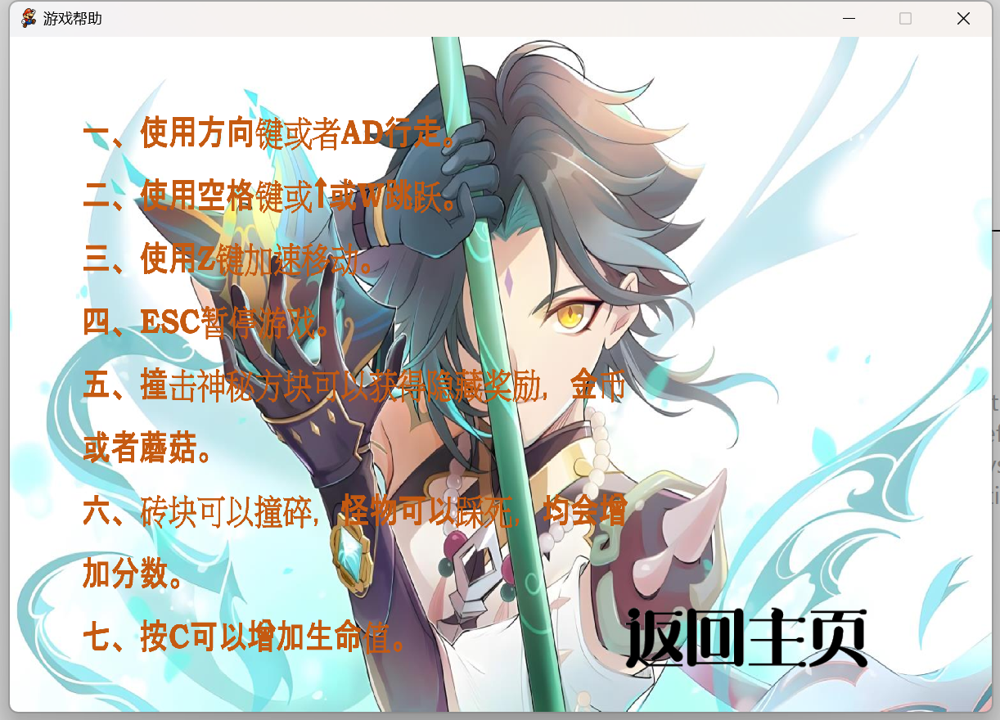
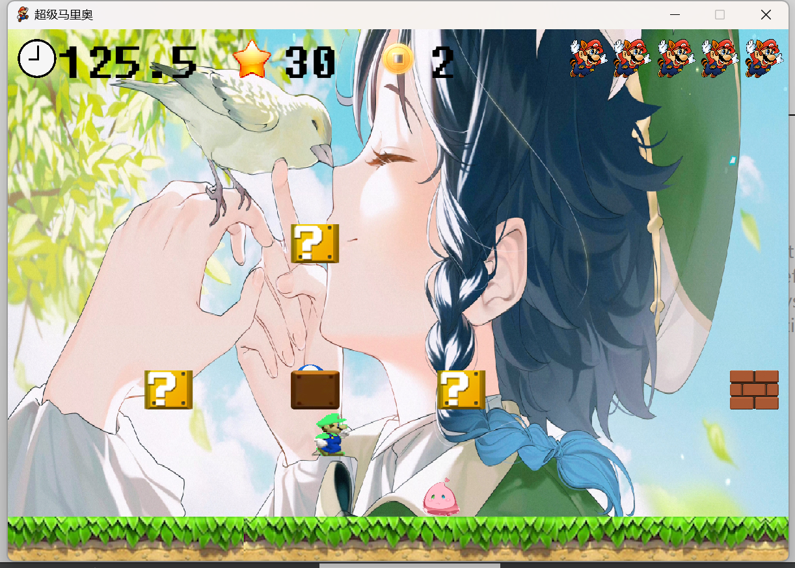
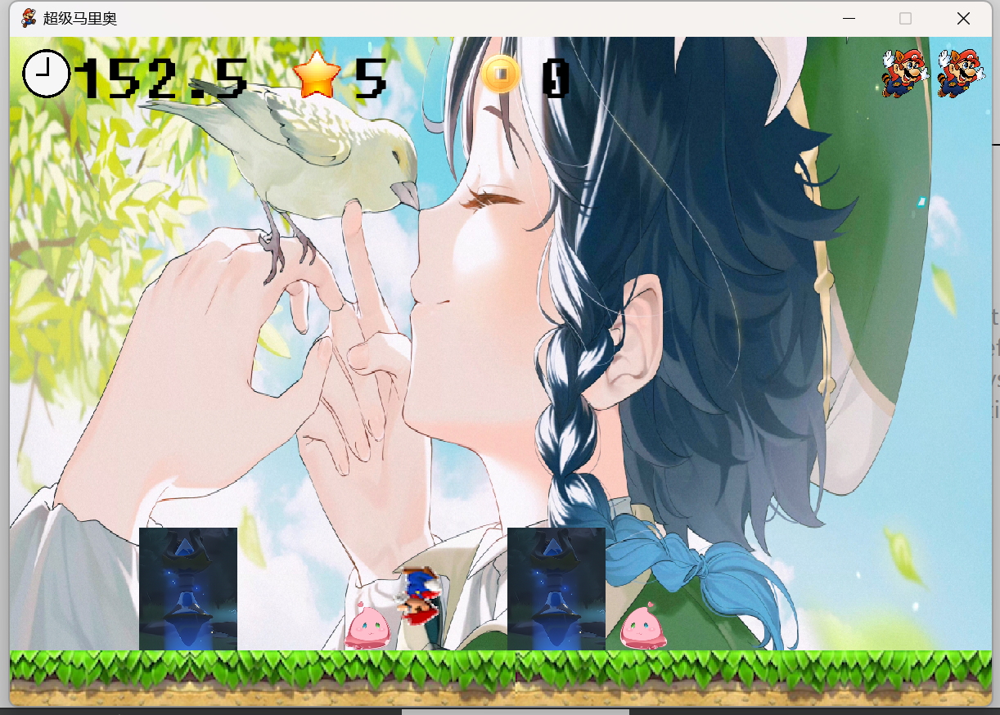
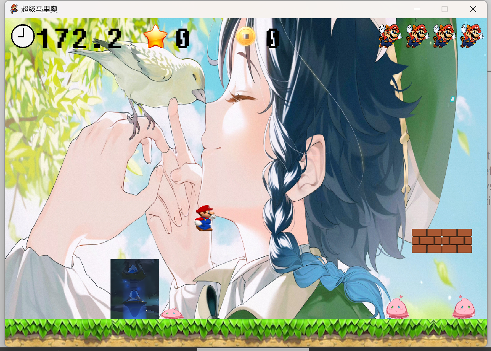
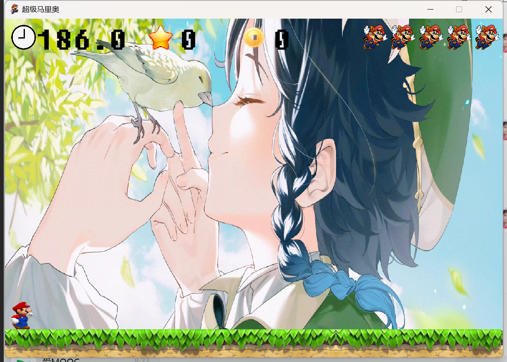

# 一、作业题目

当马里奥进入原神世界之后

# 二、开发软件

QT 12.0.2 community

# 三、开发流程

# 主题思路：

马里奥游戏中所需要的类给创建出来，分别写出他们的属性

创建出所需要的函数来呈现其中的相互作用关系

## 游戏实现前的准备：

### 马里奥类

```c++
#ifndef MARIO_H
#define MARIO_H


#include<QString>
//主角马里奥类
class Mario
{
public:
    Mario(); // 构造函数

    int x; // 角色的理论x坐标
    int map_x; // 角色在地图中的x坐标
    int y; // 角色y坐标
    int colour; // 角色颜色
    int life; // 角色生命
    int walk_state; // 行走动画状态
    int ground_state; // 地面动画状态
    int height; // 角色高度
    int distance; // 跳跃距离
    int die_state; // 死亡状态
    int die_pix_state; // 死亡像素状态
    int speed;//马里奥速度

    int invincible_state; // 无敌状态
    bool can_move; // 是否可以移动
    bool is_invincible; // 是否无敌
    bool is_die; // 判断角色是否死亡
    bool is_jump; // 判断角色是否跳跃
    bool is_jump_end; // 判断角色单次跳跃是否结束
    bool is_space_release; // 空格键是否释放
    QString direction; // 角色移动的方向

    void Mario_Init(); // 角色初始化函数
    void Move_state(); // 移动状态更新函数


    void Mario_Move(const QString &direction); // 角色移动函数
    void Jump_And_Down(); // 跳跃和下落函数
    void Mario_die(); // 角色死亡函数
};

#endif // MARIO_H

```

### 砖块类

```c++
#ifndef BRICK_H
#define BRICK_H

#include<QVector>
#include<QMap>

class Brick
{
public:
    QVector<int> v;
    QVector<QVector<int>> v2; // 储存坐标的二维容器
    QMap<int, QVector<QVector<int>>> m;

    int left_shatter_x; // 左碎块的 x 坐标
    int left_shatter_y; // 左碎块的 y 坐标
    int right_shatter_x; // 右碎块的 x 坐标
    int right_shatter_y; // 右碎块的 y 坐标
    
    int shatter_state; // 砖块的状态

    Brick(); // 构造函数声明

    // 初始化砖块
    void BrickInit();

    // 获取碎块状态的函数声明
    void ShatterState();

    // 碎裂砖块的函数声明，接受一个二维整数向量的迭代器作为参数
    void BrickShatter(QVector<QVector<int>>::iterator it);
};

#endif // BRICK_H

```

### master类

```c++
#ifndef MASTER_H
#define MASTER_H

#include<QMap>
#include<QVector>

#include"mario.h"
#include"pipe.h"
#include"brick.h"
#include<QSoundEffect>

class Master
{
public:
    int die_state;

    Mario *mario;
    Pipe *pipe;
    Brick *brick;
    //设置master死亡音效
    QSoundEffect *master_Death_Music;

    QVector<int> v;
    QVector <QVector<int>> v1;
    QMap<int, QVector<QVector < int>>> m;//保存master的坐标

    Master();
    //怪兽初始化
    void Master_Init();
    //指针
    void Master_State(Mario *m, Pipe *p, Brick *r);
    //怪兽移动处理
    void Master_Move();
};

#endif // MASTER_H

```

### mushroom类

```c++
#ifndef MUSHROOM_H
#define MUSHROOM_H

#include<QVector>
#include<QMap>
#include"brick.h"
#include"unkown_surprise.h"
#include"mario.h"
#include"castle.h"
#include<QSoundEffect>


class MushRoom
{
public:
    //储存mushroom的坐标
    QMap<int,QVector<QVector<int>>>m;
    //mushroom的形态
    int mushroom_kind;
    //mushroom的坐标
    int mushroom_x;
    int mushroom_y;
    //mushroom的状态
    int mushroom_state;
    int mushroom_fall_down_distance;
    //砖块
    Brick *brick;
    Unknown_Surprise *unknown;
    Mario *mario;

    //吃掉蘑菇的音乐
    QSoundEffect *Grow_up_Music;

    MushRoom();

    //初始化mushroom
    void MushRoom_Init();

    //更新mushroom的状态
    void Move_state();

    //mushroom的移动
    void MushRoom_Move(QVector<QVector<int>>::iterator it,Unknown_Surprise *u,Brick *r, Mario *m);


};

#endif // MUSHROOM_H

```

### pipe类

```c++
#ifndef PIPE_H
#define PIPE_H

#include<QMap>
#include<QVector>

class Pipe
{
public:
    QVector<int> v;
    QVector <QVector<int>> v2;
    QMap<int, QVector<QVector < int>>> short_m;//保存短管道的坐标
    QMap<int, QVector<QVector < int>>> long_m;//保存长管道的坐标
    //初始化管道
    void Pipe_Init();

    Pipe();
};

#endif // PIPE_H

```

### 神秘砖块类

```c++
#ifndef UNKNOWN_SURPRISE_H
#define UNKNOWN_SURPRISE_H

#include<QVector>
#include<QMap>


class Unknown_Surprise
{
public:

    int coin;//金币
    int coin_x;//金币的横坐标
    int coin_y;//金币的纵坐标
    int unknown_state;//未知惊喜的状态
    int coin_state;//金币的状态
    QVector<int> v;
    QVector <QVector<int>> v2;
    QMap<int, QVector<QVector < int>>> m;//保存坐标和状态

    Unknown_Surprise();

    //初始化
    void Unknown_Init(); // 初始化神秘方块状态

    void Unknown_State(); // 更新神秘方块状态

    void Crash_state(); // 更新碰撞状态

    void Unknown_crash(QVector<QVector<int>>::iterator it); // 处理顶到未知方块
};


#endif // UNKOWN_SURPRISE_H

```

将类封装之后，在对应的.cpp中实现。

其中，在游戏过程中需要创建新的窗口，以及在原来的窗口进行绘制

## 游戏实现

### 主窗口


主窗口中有三个my_pushbutton 分别是btn_start ,btn_help,btn_exit

对按钮类重写，让其在点击时有动画效果和音效

### 游戏帮助

点击帮助按钮进入游戏帮助页面（这个页面是重新写的Qwidget类）

逻辑是将mainwindow隐藏，

```c++
 connect(help_Btn,&QPushButton::clicked,[=](){
        help_Btn->zoom1();//动画效果
        help_Btn->zoom2();
        QTimer::singleShot(400,this,[=](){
            
            this->hide();//隐藏
            gamehelp = new game_help();
            gamehelp->show();//出现
            connect(gamehelp,&game_help::back,this,[=](){//接受game_help类中的信号，用lambda表达式让主界面重现
                this->show();
            });
        });
    });
```





游戏帮助中有一个返回主页的按钮

在游戏帮助的类中，有一个信号函数

```c++
signals:
    //回到上一页
    void back();
```


当点击返回主页按钮时发送信号

```c++
connect(back_Btn, &QPushButton::clicked, [=]() {
        back_Btn->zoom1();
        back_Btn->zoom2();
        QTimer::singleShot(500, this, [=]() {
            this->close();
            emit
                this->back();
        });
    });
```


### 退出游戏


```c++
connect(end_Btn,&QPushButton::clicked,[=](){
        end_Btn->zoom1();
        end_Btn->zoom2();
        QTimer::singleShot(500,this,[=](){
            this->close();
        });
    });
```


### 开始游戏

点击开始游戏

同理，也是重写了一个cinema界面

##### 构造函数

首先进行cinema的构造函数

```c++
Cinema::Cinema(QWidget *parent)
    : QWidget{parent}
{
    //设置标题
    setWindowTitle("超级马里奥");
    setFixedSize(800, 545);

    Music_Init();//添加音乐
    Game_Init();//游戏数据初始化
    Pause_Init();//添加暂停界面


    //显示1.5秒界面之后，开始游戏
    QTimer::singleShot(1500, this, [=]() {

        timer1 = startTimer(15)；//用来表示update的时间间隔
        timer3 = startTimer(40);//更新剩余时间的间隔

        game_start = true;
    });
}

```

##### 三个初始化（音乐、游戏、暂停）

大部分音效是在这里进行初始化的，还有一部分是在各种类内进行初始化 

同时在堆区创建暂停的对话框

```c++
void Cinema::Music_Init()
{
    //普通背景音乐
    main_theme_Music = new QSoundEffect;
    main_theme_Music->setSource (QUrl::fromLocalFile(":/music/main_theme.wav"));
    main_theme_Music->setLoopCount(QSoundEffect::Infinite);//无限循环
    main_theme_Music->setVolume(0.5f);
    //死亡音乐
    death_Music = new QSoundEffect;
    death_Music->setSource(QUrl::fromLocalFile(":/music/death.wav"));
    death_Music->setVolume(0.5f);
    //游戏结束 生命用光的音乐
    Out_of_Life_Music = new QSoundEffect;
    Out_of_Life_Music->setSource(QUrl::fromLocalFile(":/music/game_over.wav"));
    Out_of_Life_Music->setVolume(0.5f);
    //加速之后的音乐
    main_theme_sped_up_Music = new QSoundEffect;
    main_theme_sped_up_Music->setSource(QUrl::fromLocalFile(":/music/main_theme_sped_up.wav"));
    main_theme_sped_up_Music->setLoopCount(QSoundEffect::Infinite);//无限循环
    main_theme_sped_up_Music->setVolume(0.5f);
    //超时的音乐
    Out_of_Time_Music = new QSoundEffect;
    Out_of_Time_Music->setSource(QUrl::fromLocalFile(":/music/out_of_time.wav"));
    Out_of_Time_Music->setVolume(0.5f);
    //砖块破碎
    brick_Break_Music = new QSoundEffect;
    brick_Break_Music->setSource(QUrl::fromLocalFile(":/music/break.wav"));
    brick_Break_Music->setVolume(0.5f);
    //游戏胜利
    Game_Win_Music = new QSoundEffect;
    Game_Win_Music->setSource(QUrl::fromLocalFile(":/music/win.wav"));
    Game_Win_Music->setVolume(0.5f);

    //获得金币
    Coin_Music = new QSoundEffect;
    Coin_Music->setSource(QUrl::fromLocalFile(":/music/coin.wav"));
    Coin_Music->setVolume(0.5f);
    //出现蘑菇
    Mushroom_Music = new QSoundEffect;
    Mushroom_Music->setSource(QUrl::fromLocalFile(":/music/powerup_appears_1.wav"));
    Mushroom_Music->setVolume(0.5f);
    //跳跃音效
    Jump_Music = new QSoundEffect;
    Jump_Music ->setSource(QUrl::fromLocalFile(":/music/jump.wav"));
    Jump_Music->setVolume(0.5f);
}

void Cinema::Game_Init()// 初始化游戏
{

    mario = new Mario;
    brick = new Brick;
    pipe = new Pipe;
    unknown = new Unknown_Surprise;
    mushroom = new MushRoom;
    master = new Master;
    castle = new Castle;

    QTimer::singleShot(1500, this, [=]() {
        main_theme_Music->play();
    });
    key = "null";//运动方向
    is_win_dialog_show = false;
    is_press_x = false;
    is_win = false;
    score = 0;//分数
    time = 200.0;//倒计时

    is_kill_timer2 = true;
    game_start = false;
    master->Master_State(mario, pipe, brick);
}
// 初始化暂停状态
void Cinema::Pause_Init()
{
    Pause = new Game_Pause();//初始化暂停窗口
    //链接继续游戏
    connect(Pause->btn_continue, &QPushButton::clicked, this, [=](){
        QTimer::singleShot(500, this, [=]() {
            timer1 = startTimer(15);
            timer3 = startTimer(40);
            mario->walk_state = 0;//初始化mario的行走状态
            key = "null";
            Pause->hide();
        });
    });
    //链接重新游戏
    connect(Pause->initGame, &QPushButton::clicked, this, [=]() {
        QTimer::singleShot(500, this, [=]() {
            Game_Init();//游戏初始化
            Pause->hide();
            QTimer::singleShot(1500, this, [=]() {
                timer1 = startTimer(15);//开启定时器
                timer3 = startTimer(40);
                game_start = true;
            });
        });
    });

    //链接退出游戏
    connect(Pause->btn_exit, &QPushButton::clicked, this, [=]() {
        QTimer::singleShot(500, this, [=]() {
            this->close();
        });
    });

}
```

暂停对话框


##### 绘制函数

绘制的项目如下

```c++
void Cinema::paintEvent(QPaintEvent *)
{
    QPainter painter(this);

    if (!game_start)  // 如果游戏尚未开始
    {
        // 加载自定义字体文件
        int  fontId = QFontDatabase::addApplicationFont(":/fonts/Fixedsys500c.ttf");

        // 获取字体名称
        QString fontName = QFontDatabase::applicationFontFamilies(fontId).at(0);
        // 绘制游戏未开始时的界面
        painter.drawPixmap(0, 0, 800, 550, QPixmap(":/photo/background2.png")); // 背景
        painter.drawPixmap(340, 90, 40, 40, QPixmap(":/photo/life.png")); // 绘制生命图标
        painter.setPen(QColor(0, 0, 0)); // 设置画笔颜色
        QFont font(fontName); // 创建字体对象

        font.setPointSize(35); // 设置字体大小
        painter.setFont(font); // 设置字体
        painter.drawText(400, 120, "x"); // 绘制生命图标右侧的"x"
        painter.drawText(80, 40, "times:"); // 绘制计时文本
        painter.drawText(240, 40, QString::number(time, 'f', 1)); // 绘制倒计时
        painter.drawText(600, 40, "coin:"); // 绘制金币文本
        painter.drawText(720, 40, QString::number(unknown->coin)); // 绘制金币数量

        font.setPointSize(45); // 设置字体大小
        painter.setFont(font); // 设置字体
        painter.drawText(440, 125, QString::number(mario->life)); // 绘制生命值


        return;

    }
    // 加载自定义字体文件
    int  fontId = QFontDatabase::addApplicationFont(":/fonts/Fixedsys500c.ttf");

    // 获取字体名称
    QString fontName = QFontDatabase::applicationFontFamilies(fontId).at(0);
    QFont font(fontName); // 创建字体对象
    font.setPointSize(40); // 设置字体大小

    painter.drawPixmap(0, 0, 800, 550, QPixmap(":/photo/sky1.png"));//画背景


    //画得分
    QPixmap pixmap(":/photo/score.png");
    QPixmap scaledPixmap = pixmap.scaled(40, 40); // 缩放为30x30大小
    painter.drawPixmap(QPointF(230, 10), scaledPixmap);

    // painter.drawPixmap(280, 80, QPixmap(":/photo/score.png"), 0, 0, 100, 100);//金币图标
    painter.drawPixmap(380, 10, 40, 40, QPixmap(":/photo/gold_cion.png"));
    painter.setFont(font);

    painter.drawText(280, 50, QString::number(score));
    painter.drawText(430, 50, QString::number(unknown->coin));
    //绘制生命值
    for (int i = 1; i <= mario->life; i++)
    {
        painter.drawPixmap(800 - i * 45, 10, 40, 40, QPixmap(":/photo/life.png"));
    }
    //绘制倒计时图标
    painter.drawPixmap(10, 10, 40, 40, QPixmap(":/photo/time.png"));
    //绘制倒计时'f'表示浮点数
    painter.drawText(50, 50, QString::number(time, 'f', 1));
    //绘制草坪地板
    painter.drawPixmap(0, 500, QPixmap(":/photo/ground.png"), mario->ground_state, 0, 800, 45);//画地板
    //如果马里奥的横坐标已经超过过7800 就可以画出城堡
    if (mario->x > 7800)
    {
        QVector < QVector < int >> ::iterator it = castle->m.begin()->begin();

        QPixmap pixmap(":/photo/castle1.png");
        QPixmap scaledPixmap = pixmap.scaled(260, 260);
        painter.drawPixmap(QPointF(*it->begin() - mario->x, *(it->begin() + 1)), scaledPixmap);


         //城堡相对于马里奥的坐标为它的初始值8700 减去马里奥现在的横坐标 ，纵坐标为其本身的纵坐标
        // painter.drawPixmap(*it->begin() - mario->x, *(it->begin() + 1), 200, 200, QPixmap(":/photo/castle1.png"));
    }
    //蘑菇
    if (mushroom->mushroom_state != 0)
    {
        painter.drawPixmap(mushroom->mushroom_x - mario->x, mushroom->mushroom_y, 40, 40,
                           QPixmap(":/photo/mushroom" + QString::number(mario->colour) + ".png"));
    }

    //绘制砖块 宽50 高40
    for (QVector < QVector < int >> ::iterator it = brick->m.begin()->begin(); it != brick->m.begin()->end(); it++)
    {
        //在玛丽后的50像素的和在玛丽前的800像素（绘制超过宽度的像素）的并且没有碎掉的砖块
        if (*it->begin() - mario->x >= -50 && *it->begin() - mario->x <=800 && *(it->begin() + 2) == 1)
        {
            painter.drawPixmap(*it->begin() - mario->x, *(it->begin() + 1), 50, 40, QPixmap(":/photo/brick1.png"));
        }
    }

    //绘制神秘方块
    for (QVector < QVector < int >> ::iterator it = unknown->m.begin()->begin(); it != unknown->m.begin()->end();it++)
    {
        //没有顶过的
        //
        //
        if (*it->begin() - mario->x >= -50 && *it->begin() - mario->x <= 800 && *(it->begin() + 2) != 0)
        {
            painter.drawPixmap(*it->begin() - mario->x, *(it->begin() + 1), QPixmap(":/photo/unknown.png"),
                               unknown->unknown_state, 0, 50, 40);
        }
        //被顶过的
        else if (*it->begin() - mario->x >= -50 && *it->begin() - mario->x <= 800 && *(it->begin() + 2) == 0)
        {
            painter.drawPixmap(*it->begin() - mario->x, *(it->begin() + 1), 50, 40,
                               QPixmap(":/photo/unknown_after.png"));
        }
    }
    if (unknown->coin_state > 0)
    {
        painter.drawPixmap(unknown->coin_x - mario->x, unknown->coin_y, QPixmap(":/photo/coin.png"), unknown->coin_state,0, 30, 33);
    }
    //绘制管道  长管道 宽80 高100
    for (QVector < QVector < int >> ::iterator it = pipe->long_m.begin()->begin(); it != pipe->long_m.begin()->end();it++)
    {
        if (*it->begin() - mario->x >= -80 && *it->begin() - mario->x < 800)
        {
            painter.drawPixmap(*it->begin() - mario->x, *(it->begin() + 1), 80, 100, QPixmap(":/photo/pipe_long.png"));
        }
    }
    //短管道 80*50
    for (QVector < QVector < int >> ::iterator it = pipe->short_m.begin()->begin(); it != pipe->short_m.begin()->end();it++)
    {
        if (*it->begin() - mario->x > -80 && *it->begin() - mario->x < 800)
        {
            painter.drawPixmap(*it->begin() - mario->x, *(it->begin() + 1), 80, 50, QPixmap(":/photo/pipe_short.png"));
        }
    }

    //绘制砖块碎掉的动画
    if (brick->shatter_state > 0)
    {
        painter.drawPixmap(brick->left_shatter_x - mario->x, brick->left_shatter_y - 20, 30, 30,
                           QPixmap(":/photo/brick2.png"));
        painter.drawPixmap(brick->left_shatter_x - mario->x, brick->left_shatter_y + 50, 30, 30,
                           QPixmap(":/photo/brick2.png"));
        painter.drawPixmap(brick->right_shatter_x - mario->x, brick->right_shatter_y - 20, 30, 30,
                           QPixmap(":/photo/brick3.png"));
        painter.drawPixmap(brick->right_shatter_x - mario->x, brick->right_shatter_y + 50, 30, 30,
                           QPixmap(":/photo/brick3.png"));
    }

    //绘制master master的第三个坐标代表状态 0代表死亡 第四个代表方向 0代表左侧
    for (QVector < QVector < int >> ::iterator it = master->m.begin()->begin(); it != master->m.begin()->end();it++)
    {
        if (*it->begin() - mario->x > -80 && *it->begin() - mario->x < 800 && *(it->begin() + 2) != 0)
        {
            painter.drawPixmap(*it->begin() - mario->x, *(it->begin() + 1), 40, 40,
                               QPixmap(":/photo/master_" + QString::number(*(it->begin() + 3)) + ".png"));
        }
        //
        //如果master被踩死  并且没有消失
        else if (*it->begin() - mario->x > -80 && *(it->begin()) - mario->x < 800 && *(it->begin() + 2) == 0 &&*(it->begin() + 4) == 1)
        {
            painter.drawPixmap(*it->begin() - mario->x, *(it->begin() + 1) + 20, 40, 20,
                               QPixmap(":/photo/master_" + QString::number(*(it->begin() + 3)) + ".png"));
        }

        //如果马里奥死亡
        if (mario->is_die)
        {
            painter.drawPixmap(mario->map_x, mario->y, QPixmap(":/photo/mary_die.png"), mario->die_pix_state, 0, 50, 50);//画角色
        }
        //如果没死亡
        else if (!mario->is_die && mario->invincible_state % 2 == 0 && !is_win)
        {
            if(mario->x==8800 && mario->y !=460){

            }
            else{
            painter.drawPixmap(mario->map_x, mario->y,
                               QPixmap(":/photo/walk_" +  mario->direction + QString::number(mario->colour) + ".png"),
                               mario->walk_state, 0, 45, 45);//画角色
            }
        }
 
    //绘制旗帜
    QPixmap flag_pole(":/photo/flag.png");
    QPixmap scaledflag_pole = flag_pole.scaled(50, 550);
    painter.drawPixmap(QPointF(9100 - mario->x, 0), scaledflag_pole);


    QPixmap flag_map(":/photo/flag2.png");
    QPixmap scaledflag_map = flag_map.scaled(50, 50);

    QPixmap mario_flag(":/photo/FlagMary.png");
    QPixmap scaledmario_flag = mario_flag.scaled(50, 50);
    if(mario->x < 8800){
        painter.drawPixmap(QPointF(9100 - mario-> x+30, 40), scaledflag_map);
    }
    else if(mario->x == 8800)
    {
        painter.drawPixmap(QPointF(9100 - mario-> x + 30, mario->y), scaledflag_map);
        painter.drawPixmap(QPointF(9100 - mario-> x , mario->y), scaledmario_flag);
    }

}

```

效果如下









当游戏开始之后

进行对应的绘制




开始倒计时

此时我用了两个计时器来完成计时和游戏页面刷新

##### 重写键盘事件函数

```c++
void Cinema::timerEvent(QTimerEvent *event)
{
    if (event->timerId() == timer1 && mario->is_die)
    {
        mario->Mario_die();

        Die_Init();

        update();
        return;
    }
    if (event->timerId() == timer1)
    {

        mario->Mario_Move(key);//马里奥的移动，当按下对应按键key是left或right
        mario->Jump_And_Down();
        Jump_Collision();//跳跃检测
        Move_Collision();//移动检测
        brick->ShatterState();//砖块破碎检测
        mushroom->Move_state();//蘑菇的移动
        master->Master_Move();//master的移动

        if(mario->is_die&&mario->life>1)
        {
            death_Music->play();
        }
        else if(mario->is_die)
        {
            Out_of_Life_Music->play();
        }
        Die_Init();//如果死亡就初始化
        Fall_Down(mario->y);//跌落检测
        update();//刷新屏幕
    }

    if (event->timerId() == timer2)
    {
        mario->Mario_Move(key);
    }
    //数据更新频率
    if (event->timerId() == timer3)
    {
        time -= 0.04;

        if(time<=0)
        {
            //超时
            killTimer(timer1);
            if (is_kill_timer2)
            {
                //关闭计时器2
                killTimer(timer2);
            }
            //关闭计时器3
            killTimer(timer3);
            main_theme_Music->stop();
            Out_of_Time_Music->play();
            QTimer::singleShot(3000, this, [=](){
                Out_of_Time_Music->stop();

            } );
            Game_Over();

        }
        unknown->Unknown_State();
        unknown->Crash_state();
    }


}
```

##### 重写按键函数

```c++
void Cinema::keyPressEvent(QKeyEvent *event)
{
    if (!mario->is_die && (9100 - mario->x) >300)
    {
        switch (event->key())
        {
        case Qt::Key_Right:
        case Qt::Key_D:
            mario->direction = "right";
            key = "right";
            break;
        case Qt::Key_Left:
        case Qt::Key_A:
            mario->direction ="left";
            key = "left";
            break;
            //开始计时器2 用来加速
        case Qt::Key_Z:
            main_theme_Music->stop();
            main_theme_sped_up_Music->play();
            timer2 = startTimer(25);
            is_kill_timer2 = false;
            break;
        case Qt::Key_Space:
        case Qt::Key_W:
        case Qt::Key_Up:
            if(mario->height > 0)
            {
                Jump_Music->play();
            }
            mario->is_jump = true;

            break;
        case Qt::Key_X:
            if (!is_press_x && !mario->is_jump && mario->is_jump_end && mario->colour == 3)
            {
                is_press_x = true;
                //  fire->Fire_xy();
            }
            break;
        }
    }

}

//按键函数 释放按键 执行相应的函数
void Cinema::keyReleaseEvent(QKeyEvent *event)
{
    if (!mario->is_die||(9100 - mario->x) >300)
    {
        switch (event->key())
        {
        case Qt::Key_Right:
        case Qt::Key_D:
            mario->walk_state = 0;
            key = "null";
            break;
        case Qt::Key_Left:
        case Qt::Key_A:
            mario->walk_state = 0;
            key = "null";
            break;
            //关闭计时器2
        case Qt::Key_Z:
            main_theme_sped_up_Music->stop();
            main_theme_Music->play();
            is_kill_timer2 = true;
            killTimer(timer2);
            break;
        case Qt::Key_Space:
        case Qt::Key_W:
        case Qt::Key_Up:

            mario->is_jump = false;
            mario->is_space_release = true;
            break;

        case Qt::Key_X:
            is_press_x = false;
            break;
        case Qt::Key_Escape:
            if (game_start)
            {

                //关闭计时器1
                killTimer(timer1);
                if (is_kill_timer2)
                {
                    //关闭计时器2
                    killTimer(timer2);
                }
                main_theme_Music->stop();
                //关闭计时器3
                killTimer(timer3);
                // Game_Pause *Pause = new Game_Pause();
                Pause->setParent(this);
                Pause->exec();
                delete Pause;
                main_theme_Music->play();
                Pause_Init();
            }
            break;
        case Qt::Key_C:
            if (mario->life < 8)
            {
                mario->life++;
            }
            break;

        }
    }
}

```

##### 几个检测函数的实现

```c++
//检测mario 是否落在什么东西的上面
void Cinema::Fall_Down(int &y)
{
    if (mario->height - mario->distance < 0)
    {
        //Mario落在地面
        if (y > 455)
        {
            y = 455;
            mario->is_jump_end = true;
            mario->distance = 0;
            mario->height = 20;
            return;
        }
        //Mario落在砖块上面
        for (QVector < QVector < int >> ::iterator it = brick->m.begin()->begin(); it != brick->m.begin()->end(); it++)
        {

            if (*it->begin() - mario->x - 300 >= -30 && *it->begin() - mario->x - 300 <= 30 &&
                *(it->begin() + 1) <= y + 50 && *(it->begin() + 1) >= y + 25 && *(it->begin() + 2) == 1)
            {
                y = *(it->begin() + 1) - 45;
                mario->is_jump_end = true;
                mario->height = mario->distance = 20;
                return;
            }
        }
        for (QVector < QVector < int >> ::iterator it = unknown->m.begin()->begin(); it != unknown->m.begin()->end();it++)
        {
            //Mario落在神秘方块上面
            if (*it->begin() - mario->x - 300 >= -30 && *it->begin() - mario->x - 300 <= 30 &&
                *(it->begin() + 1) <= y + 50 && *(it->begin() + 1) >= y + 25)
            {
                y = *(it->begin() + 1) - 45;
                mario->is_jump_end = true;
                mario->height = mario->distance = 20;
                return;
            }
        }
        //Mario落在管道上面
        for (QVector < QVector < int >> ::iterator it = pipe->long_m.begin()->begin(); it !=pipe->long_m.begin()->end();it++)
        {
            if (*it->begin() - mario->x - 300 >= -50 && *it->begin() - mario->x - 300 <= 30 &&
                *(it->begin() + 1) <= y + 50 && *(it->begin() + 1) >= y + 25)
            {
                y = *(it->begin() + 1) - 45;
                mario->is_jump_end = true;
                mario->height = mario->distance = 20;
                return;
            }
        }
        for (QVector < QVector < int >> ::iterator it = pipe->short_m.begin()->begin(); it != pipe->short_m.begin()->end();it++)
        {
            if (*it->begin() - mario->x - 300 >= -50 && *it->begin() - mario->x - 300 <= 30 &&
                *(it->begin() + 1) <= y + 50 && *(it->begin() + 1) >= y + 25)
            {
                y = *(it->begin() + 1) - 45;
                mario->is_jump_end = true;
                mario->height = mario->distance = 20;
                return;
            }
        }
    }
}

//检测mario 平移过程中 是否 碰到 障碍物
void Cinema::Move_Collision() {

    // 检测 mario 是否与砖块发生了碰撞
    for (QVector < QVector <int> >::iterator it = brick->m.begin()->begin(); it != brick->m.begin()->end(); it++)
    {
        // 如果 mario 向右移动并且与砖块相交
        if (*it->begin() - mario->x - 300 >= 35 && *it->begin() - mario->x - 300 <= 40 &&
            *(it->begin() + 1) > mario->y  -35 && *(it->begin() + 1) - mario->y < 35 &&
            mario->direction == "right" && *(it->begin() + 2) == 1)
        {
            mario->can_move = false; // 禁止移动
            return;
        }
        else if (*it->begin() - mario->x - 300 >= -40 && *it->begin() - mario->x - 300 <= -35 &&
                 *(it->begin() + 1) - mario->y > - 35 && *(it->begin() + 1) - mario->y < 35 &&
                 mario->direction == "left" && *(it->begin() + 2) == 1)
        {
            mario->can_move = false; // 禁止移动
            return;
        }
    }

    // 检测mario是否与神秘方块发生了碰撞
    for (QVector<QVector<int>>::iterator it = unknown->m.begin()->begin(); it != unknown->m.begin()->end(); it++)
    {
        // 如果mario向右移动并且与神秘方块碰撞
        if (*it->begin() - mario->x - 300 >= 35 && *it->begin() - mario->x - 300 <= 40 &&
            *(it->begin() + 1) - mario->y >= -35 && *(it->begin() + 1) - mario->y <= 35 && mario->direction == "right")
        {
            mario->can_move = false; // 禁止移动
            return;
        }
        else if (*it->begin() - mario->x - 300 >= -40 && *it->begin() - mario->x - 300 <= -35 &&
                 *(it->begin() + 1) - mario->y > - 35 && *(it->begin() + 1) - mario->y < 35 &&
                 mario->direction == "left" && *(it->begin() + 2) == 1)
        {
            mario->can_move = false; // 禁止移动
            return;
        }
    }

    // 检测mario 是否与水管发生了碰撞
    for (QVector<QVector<int>>::iterator it = pipe->long_m.begin()->begin(); it != pipe->long_m.begin()->end(); it++)
    {

        if (*it->begin() - mario->x - 300 >= 35 && *it->begin() - mario->x - 300 <= 45 &&
            *(it->begin() + 1) - mario->y <= 45 && mario->direction == "right")
        {
            mario->can_move = false; // 禁止移动
            return;
        }
        else if (*it->begin() - mario->x - 300 >= -70 && *it->begin() - mario->x - 300 <= -50 &&
                 *(it->begin() + 1) - mario->y <= 45 && mario->direction == "left")
        {
            mario->can_move = false; // 禁止移动
            return;
        }
    }

    for (QVector<QVector<int>>::iterator it = pipe->short_m.begin()->begin(); it != pipe->short_m.begin()->end(); it++)
    {
        if (*it->begin() - mario->x - 300 >= 35 && *it->begin() - mario->x - 300 <= 45 &&
            *(it->begin() + 1) < mario->y + 45 && mario->direction == "right")
        {
            mario->can_move = false; // 禁止移动
            return;
        }
        else if (*it->begin() - mario->x - 300 >= -70 && *it->begin() - mario->x - 300 <= -55 &&
                 *(it->begin() + 1) < mario->y + 45 && mario->direction == "left")
        {
            mario->can_move = false; // 禁止移动
            return;
        }
    }
    //检测与城堡的接触
    QVector < QVector < int >> ::iterator it = castle->m.begin()->begin();
    if (*it->begin() - mario->x - 300 >= -220 && *it->begin() - mario->x - 300 <= -40 &&
        *(it->begin() + 1) < mario->y - 100 && *(it->begin() + 1) > mario->y - 270) {


        main_theme_Music->stop();
        Game_Win_Music->play();


        if(is_win_dialog_show == false){

            Game_Win();
            is_win_dialog_show = true;

        }
    }

    qDebug()<<mario->x;

    mario->can_move = true;
    if(mario->x==8800 && mario->y!=455)
    {
        mario->can_move = false;
    }

    if((9100 - mario->x) <=300 && mario->y < 455)
    {
        mario->x =8800;
        mario->y +=1;
        mario->is_jump = false;
        mario-> is_jump_end = true;
        mario->is_space_release = true;
        mario->distance = 0;
    }
    else if((9100 - mario->x) <= 300 && mario->y >= 455)
    {
        key = "right";
        mario->speed = 2;
        mario->y = 455;
    }

}

//检测mario跳跃过程中 是否 碰到 障碍物
void Cinema::Jump_Collision() {
    // 检查mario的跳跃高度是否为0或负值，如果是则直接返回，表示没有发生跳跃
    if (mario->height - mario->distance <= 0)
    {
        return;
    }

    // 遍历砖块对象中的砖块，检测是否发生了碰撞
    for (QVector<QVector<int>>::iterator it = brick->m.begin()->begin(); it != brick->m.begin()->end(); it++)
    {
        // 如果mario顶到砖块
        if (*it->begin() - mario->x - 300 >= -30 && *it->begin() - mario->x - 300 <= 30 &&
            *(it->begin() + 1) - mario->y + 40 >= -10 && *(it->begin() + 1) - mario->y + 40 <= 20 &&
            *(it->begin() + 2) == 1) {
            // 增加得分
            score += 5;
            // 碎裂砖块
            brick->BrickShatter(it);
            //设置砖块破碎音效
            brick_Break_Music->play();
            // 更新砖块状态
            *(it->begin() + 2) = 0;
            // 更新mario的位置

            //让mario停留在碰撞的位置
            mario->y = *(it->begin() + 1) + 40;
            mario->height = mario->distance;
            return;
        }
    }

    // 遍历神秘方块中的物体，检测是否发生了碰撞
    for (QVector<QVector<int>>::iterator it = unknown->m.begin()->begin(); it != unknown->m.begin()->end(); it++)
    {
        // 如果mario顶到神秘方块
        if (*it->begin() - mario->x - 300 >= -30 && *it->begin() - mario->x - 300 <= 30 &&
            *(it->begin() + 1) + 40 - mario->y  >= -10 && *(it->begin() + 1) + 40 - mario->y  <= 20) {
            // 如果神秘方块类型为金币（假设值为1）
            if (*(it->begin() + 2) == 1) {
                //
                Coin_Music->play();
                // 增加金币数量
                unknown->coin++;
                // 增加得分
                score += 10;
                // 执行神秘方块的碰撞动作（产生金币）
                //
                unknown->Unknown_crash(it);
            }
            // 如果神秘方块 类型为蘑菇（假设值为2）
            else if (*(it->begin() + 2) == 2) {
                // 出现蘑菇 并让蘑菇移动
                Mushroom_Music->play();
                mushroom->MushRoom_Move(it, unknown, brick, mario);
            }
            // 更新Mario的位置
            mario->y = *(it->begin() + 1) + 40;
            // 更新神秘方块的状态（变得不神秘）
            *(it->begin() + 2) = 0;

            // 更新Mario的高度
            mario->height = mario->distance;
            return;
        }
    }
}

```

胜利和失败函数


```c++
void Cinema::Game_Win()
{

    //关闭计时器
    killTimer(timer1);
    if (is_kill_timer2)
    {      
        killTimer(timer2);

    }
    killTimer(timer3);

    QTimer::singleShot(500, this, [=]() {
        update();
        game_start = false;
        is_win = true;
    });
    win = new Game_Win_dialog;
    win->setParent(this);

    win->show();

    //链接返回主界面
    connect(win->btn_Back, &QPushButton::clicked, this, [=](){
        qDebug()<<1;

        QTimer::singleShot(500, this, [=]() {

            this->close();
            emit
                this->back();
        });


    });
    //链接重新游戏
    connect(win->btn_InitGame, &QPushButton::clicked, this, [=]() {
        QTimer::singleShot(500, this, [=]() {
            //
            //
            win->close();
            delete win;
            Game_Init();//游戏初始化
            QTimer::singleShot(500, this, [=]() {
                timer1 = startTimer(15);//开启定时器
                timer3 = startTimer(40);

                game_start = true;
                is_win = false;

            });


        });
    });

    //链接退出游戏
    connect(win->btn_Exit, &QPushButton::clicked, this, [=]() {

        QTimer::singleShot(500, this, [=]() {
            this->close();

        });
    });

}

//游戏失败窗口
void Cinema::Game_Over()
{
    qDebug()<<"AADA";
    QTimer::singleShot(500, this, [=]() {
        game_start = false;
        is_win = true;
        update();

    });
    qDebug()<<"AADA";
    game_over = new Game_Over_Dialog;//初始化暂停窗口
qDebug()<<"3ADA";
    game_over->setParent(this);
qDebug()<<"2ADA";
    game_over->show();
qDebug()<<"1ADA";
    connect(game_over->btn_Back, &QPushButton::clicked, this, [=](){

        QTimer::singleShot(500, this, [=]() {

            this->close();
            emit
                this->back();
        });
    });
    //链接重新游戏
    connect(game_over->btn_InitGame, &QPushButton::clicked, this, [=]() {

        QTimer::singleShot(500, this, [=](){
            //
            //
            game_over->close();
            delete game_over;
            Game_Init();//游戏初始化

            QTimer::singleShot(500, this, [=]() {
                timer1 = startTimer(15);//开启定时器
                timer3 = startTimer(40);
                game_start = true;
                is_win = false;
            });
        });
    });

    //链接退出游戏
    connect(game_over->btn_Exit, &QPushButton::clicked, this, [=]() {

        QTimer::singleShot(500, this, [=]() {
            this->close();

        });
    });
}
```


  

------

## 四、收获

### 1.对继承和qt的对象树的理解加深

对象树是由 QObject 派生的类组成的层次结构，这些对象通过父子关系连接在一起。

**Qobject类**

Qt 中几乎所有的类都直接或间接地派生自 QObject 类。

**父子关系**:

 Qt 中的每个 QObject 都可以有一个父对象，通过将对象设置为另一个对象的子对象，可以形成对象树。

**生命周期管理**:

 当一个 QObject 对象的父对象被销毁时，它的子对象也会被销毁，从而实现了内存管理的自动释放。这可以避免内存泄漏，并简化资源管理。

**对象查找**: 

通过调用 QObject 的 parent()、children()、findChild() 和 findChildren() 等方法，可以在对象树中查找特定的对象。

**动态创建和销毁**: 

可以在运行时动态地创建和销毁对象，只需在创建时指定对象的父对象即可将其添加到对象树中，销毁时无需手动管理内存。

**信号和槽机制**:

 QObject 类提供了信号和槽机制，使对象之间可以进行异步通信。可以轻松地在树中的不同部分传递消息和数据。

### 2.学会添加音效QSoundeffect


1. **添加音效文件**： 首先，将文件添加至资源文件中。只能是.wav形式的文件

   

2. **包含头文件**： 在代码中包含 QSoundEffect 头文件。

   ```c++
   #include <QSoundEffect>
   ```

3. **创建 QSoundEffect 实例**： 在代码中创建一个 QSoundEffect 对象，当然可以设置父类来管理资源。

   ```c++
   QSoundEffect *soundEffect = new QSoundEffect(parent);
   ```

4. **设置音效文件路径**： 设置 QSoundEffect 对象的音效文件路径。

   ```c++
   soundEffect->setSource(QUrl::fromLocalFile("path/to/your/soundfile.wav"));
   ```

5. **设置其他属性**（可选）： 根据需要，可以设置音量、循环等属性。

   ```c++
   cppCopy codesoundEffect->setVolume(0.5); // 设置音量
   soundEffect->setLoopCount(QSoundEffect::Infinite); // 设置循环次数，这里设置为无限循环
   ```

6. **播放音效**： 当需要播放音效时，调用 QSoundEffect 的 play() 方法。

   ```c++
   soundEffect->play();
   ```

7. **停止音效**（可选）： 如果需要停止音效，可以调用 stop() 方法。

   ```c++
   soundEffect->stop();
   ```

8. **释放资源**（可选）： 在不再需要 QSoundEffect 对象时，释放其资源。

   ```
   delete soundEffect;
   ```

### 3.构建字体QFond

1. **创建 QFont 对象**： 使用 QFont 构造函数创建 QFont 对象，并指定字体的名称、大小和样式。

   ```c++
   QFont font("Arial", 12, QFont::Bold);
   ```

   当然也可以用资源文件中的字体，采用 QFontDatabase 类的 addApplicationFont 方法。

   ```c++
   int fontId = QFontDatabase::addApplicationFont(":/fonts/YourFont.ttf");
   if (fontId != -1) {
       QStringList fontFamilies = QFontDatabase::applicationFontFamilies(fontId);
       if (!fontFamilies.isEmpty()) {
           QFont font(fontFamilies.first());
           // 使用字体
           // 例如：label->setFont(font);
       }
   }
   
   ```

   

2. **设置字体属性**： 使用 QFont 的成员函数设置字体的各种属性，例如字体名称、字号、粗体、斜体等。

   ```c++
   font.setFamily("Helvetica");//字体族
   font.setPointSize(14);//大小
   font.setBold(true);//加粗
   font.setItalic(true);//斜体
   ```

3. **应用字体**： 将 QFont 对象应用到控件上，例如标签、按钮、文本框等。

   ```c++
   QLabel *label = new QLabel("Hello, World!");
   label->setFont(font);
   ```

4. **获取字体属性**： 可以使用 QFont 的成员函数获取字体的属性，例如字体名称、字号、粗体、斜体等。

   ```c++
   QString family = font.family();
   int size = font.pointSize();
   bool bold = font.bold();
   bool italic = font.italic();
   ```

5. **重置字体**： 可以使用 QFont 的静态函数重置字体为应用程序的默认字体。

   ```c++
   QFont::setDefaultFont(QFont("Arial", 10));
   ```

### 4.QDebuge检测代码运行到哪里程序崩溃

在代码的运行过程中很容易崩溃，或者不知道自己的程序有没有进入函数体中执行对应的功能，这时候只需要用

qdebug来检测。

**头文件**

```c++
#include<QDebug>
```

**语法**

```c++
qDebug<<11;
qDebug<<"aa";
qDebug<<'a';
```


### 5.绘画

1. **paintEvent 函数**： QWidget 的 paintEvent 函数是 Qt 中最常用的绘画函数之一。当窗口需要被重绘时，系统会自动调用该函数。我们需要重写来自定义绘制行为。

   ```c++
   void MyWidget::paintEvent(QPaintEvent *event) {
       QPainter painter(this);
       // 在这里进行绘制操作
   }
   ```

2. **QPainter 类**： QPainter 类提供了绘图功能，它可以在 QWidget、QPixmap、QImage 等设备上进行绘图操作。我们可以使用 QPainter 在绘画事件中进行各种绘图操作，例如绘制直线、矩形、椭圆、文本等。

3. **绘图操作**： 使用 QPainter 提供的方法进行各种绘图操作。例如，使用 drawLine 绘制直线，使用 drawRect 绘制矩形，使用 drawText 绘制文本等。

   ```c++
   void MyWidget::paintEvent(QPaintEvent *event) {
       QPainter painter(this);
       painter.drawLine(0, 0, width(), height());
       painter.drawRect(20, 20, 100, 100);
       painter.drawText(50, 50, "Hello, Qt!");
   }
   ```

4. **绘制图像**： 使用 drawPixmap 绘制图像。

   ```c++
   void MyWidget::paintEvent(QPaintEvent *event) {
       QPainter painter(this);
       QPixmap pixmap(":/images/myimage.png");
       painter.drawPixmap(0, 0, pixmap);
   }
   ```

5. **其他绘图设备**： 除了在 QWidget 上绘图外，还可以在 QPixmap、QImage 等绘图设备上进行绘图操作，然后将其显示在 QWidget 上。

6. **绘制自定义图形**： 通过 QPainter 提供的绘制方法，还可以绘制自定义的图形，实现各种效果，例如绘制贝塞尔曲线、绘制自定义路径等

### 6.对键盘和鼠标检测的函数

在 Qt 中，可以通过重写 QWidget 的事件处理函数来检测键盘和鼠标事件。常用的事件处理函数包括 keyPressEvent、keyReleaseEvent、mousePressEvent、mouseReleaseEvent、mouseMoveEvent 等。

1.**键盘事件检测**：

```c++
void MyWidget::keyPressEvent(QKeyEvent *event) {
    if (event->key() == Qt::Key_Escape) {
        // 按下了 Escape 键
    } else if (event->key() == Qt::Key_Enter || event->key() == Qt::Key_Return) {
        // 按下了 Enter 键或 Return 键
    }

    // 调用父类的事件处理函数
    QWidget::keyPressEvent(event);
}
```

2.**鼠标事件检测**：

```c++
void MyWidget::mousePressEvent(QMouseEvent *event) {
    if (event->button() == Qt::LeftButton) {
        // 左键按下
    } else if (event->button() == Qt::RightButton) {
        // 右键按下
    }

    // 获取鼠标位置
    QPoint pos = event->pos();

    // 调用父类的事件处理函数
    QWidget::mousePressEvent(event);
}
```

